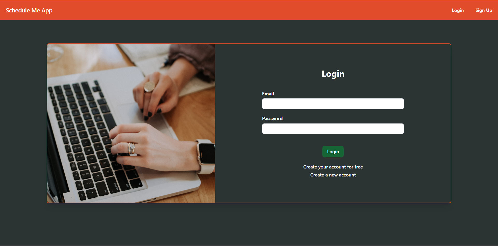

# Schedule Me App - Ruby on Rails 7 with Zoom Integration.

This is the official repository of the Schedule Me App. This web application allows users to create Zoom Meetings by creating a meeting on each project.
## Index.

1. - [Zoom documentation](./documentation/zoom-docs/zoom.md)
2. - [Database](./documentation/database/database.md)

## Images.

