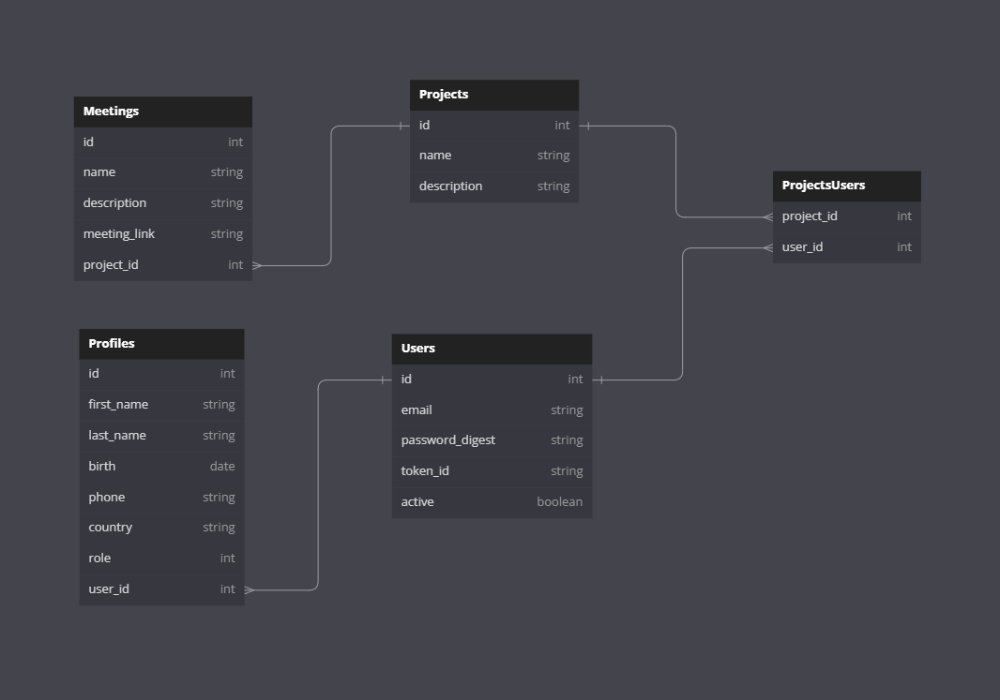

# Database.

Within this readme file, you can see all the information regarding the database, including their tables and attributes for each one.
It also provides information about the data type of each attribute.

For more information, you can check out the **schema.rb** file.

