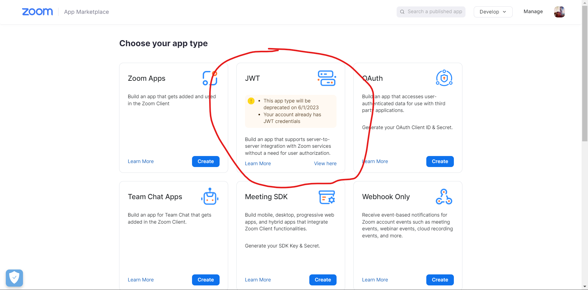
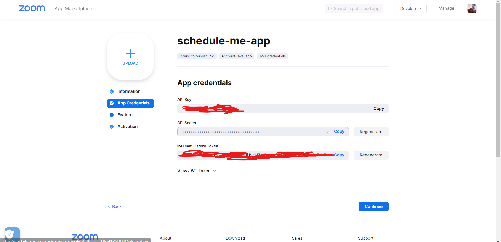

# Ruby on Rails 7 and Zoom API.

## Description

This file provide information about of how to configure the Zoom API with your Ruby on Rails project in order to create zoom meetings
on each project. You can see this blog where the author explains the configuration needed: https://azukidigital.com/blog/2022/zoom-on-rails/

## Getting Started.

1. Install the "zoom_rb" gem and run the bundle:

```ruby
gem 'zoom_rb'
```

```bash
$ bundle install
```

2. Sign in on the Zoom page and create a new app. We will use the JTW configuration. **Make sure to have the Zoom Desktop App installed** in your computer and sign in as well.



3. Create an app and copy the API KEY and the SECRET KEY in your project. You can use the "dot-env" rails gem to store your keys



4. Create an initializer in the config/initializers folder, and call it **zoom.rb**. Once is created, add the following configuration.

```ruby
Zoom.configure do |c|
  c.api_key = ENV['ZOOM_API_KEY']
  c.api_secret = ENV['ZOOM_API_SECRET']`
end
```

5. Open **rails console** and get the user_id to generate zoom's meetings.

```ruby
zoom_client = Zoom.new
zoom_client.user_list
```

6. Create your model. In this example, our Meeting model has the following attributes:

- name
- description
- meeting_link

7. You can generate zoom meetings by adding the next code in the Meeting.rb model. A callback is activated when the meeting is created.

```ruby
class Meeting < ApplicationRecord
  after_create :generate_zoom_link

  private

  def generate_zoom_link
    return if meeting_link.present?

    response = Zoom.new.meeting_create(
      topic: name,
      user_id: ENV['ZOOM_USER_ID'],
      duration: 120,
      settings: {
        join_before_host: true,
        host_video: true,
        participant_video: true,
        mute_upon_entry: true,
        waiting_room: false
      }
    )

    update(meeting_link: response['join_url'])
  end
end
```

And that's it.

## Conclusion.

You can pass several options to the constructor depending on your needs. You can visit the official documentation of the **zoom_rb** rails gem by clicking on this link: https://github.com/Jorge-Ortiz-Mata/zoom_rb

```json
{
  "scheduled_meeting": {
    "host_video": true,
    "participants_video": true,
    "audio_type": "cloud",
    "join_before_host": true,
    "use_pmi_for_scheduled_meetings": true,
    "use_pmi_for_instant_meetings": true,
    "enforce_login": true,
    "not_store_meeting_topic": true,
    "force_pmi_jbh_password": true,
    "pstn_password_protected": true
  },
  "in_meeting": {
    "e2e_encryption": true,
    "chat": true,
    "private_chat": true,
    "auto_saving_chat": true,
    "entry_exit_chime": "all",
    "record_play_voice": true,
    "file_transfer": true,
    "feedback": true,
    "co_host": true,
    "polling": true,
    "attendee_on_hold": true,
    "annotation": true,
    "remote_control": true,
    "non_verbal_feedback": true,
    "breakout_room": true,
    "remote_support": true,
    "closed_caption": true,
    "group_hd": true,
    "virtual_background": true,
    "far_end_camera_control": true,
    "share_dual_camera": true,
    "attention_tracking": true,
    "waiting_room": true,
    "allow_live_streaming": true
  },
  "email_notification": {
    "jbh_reminder": true,
    "cancel_meeting_reminder": true,
    "alternative_host_reminder": true
  },
  "recording": {
    "local_recording": true,
    "cloud_recording": true,
    "record_speaker_view": true,
    "record_gallery_view": true,
    "record_audio_file": true,
    "save_chat_text": true,
    "show_timestamp": true,
    "recording_audio_transcript": true,
    "auto_recording": "cloud",
    "auto_delete_cmr": true,
    "auto_delete_cmr_days": 42
  },
  "telephony": {
    "third_party_audio": true,
    "audio_conference_info": "Third party audio conference info",
    "show_international_numbers_link": true
  },
  "tsp": {},
  "feature": {
    "meeting_capacity": 100,
    "large_meeting": true,
    "large_meeting_capacity": 1000,
    "webinar": true,
    "webinar_capacity": 500,
    "cn_meeting": true,
    "in_meeting": true,
    "zoom_phone": true
  }
}
```
